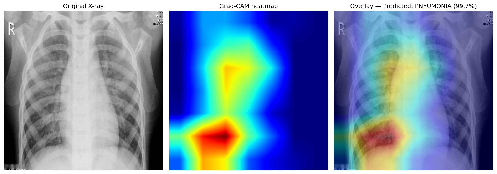
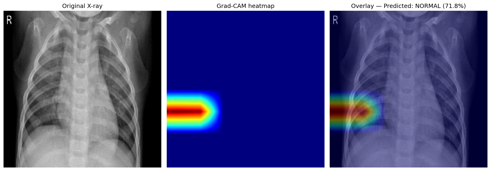

# X-Ray Pneumonia Detection

## Overview
A binary classifier built with TensorFlow/Keras that detects pneumonia from
chest X-ray images, using DenseNet121 transfer learning. Unlike previous
projects, this one prioritizes **recall over raw accuracy** — in a medical
screening context, missing an actual pneumonia case (false negative) is far
more costly than a false alarm (false positive). Includes Grad-CAM
visualizations to confirm the model's decisions are grounded in real
anatomical regions, not spurious artifacts.

## Results
| Metric | Score |
|--------|-------|
| Test accuracy | 90.54% |
| Test recall (pneumonia) | 95.38% |
| Test precision (pneumonia) | 90.07% |
| Train images | 4,434 |
| Val images | 782 (custom 15% split — original val/ folder had only 16 images) |
| Test images | 624 |


## Grad-CAM explainability

**Pneumonia case (99.7% confidence):**


Heat concentrates over central/lower lung and mediastinal regions —
anatomically consistent with where pneumonia consolidation commonly presents.

**Normal case (71.8% confidence):**


Notably lower confidence and a more peripheral, less centrally-localized
activation pattern compared to the pneumonia example — discussed further below.

## Architecture
**Two-phase training:**
1. **Frozen base** — Val recall: 99.83%, Val precision: 86.18%
2. **Fine-tuning** — last 30 layers unfrozen, lr=1e-5 — Val recall: 95.70%,
   Val precision improved

- **Optimizer:** Adam (lr=0.001 frozen → 1e-5 fine-tune)
- **Loss:** Binary Crossentropy
- **Class weighting:** NORMAL weight 1.945, PNEUMONIA weight 0.673
  (2.89:1 imbalance in training data)
- **Early stopping & checkpointing monitor `val_recall`, not `val_loss`** —
  a deliberate choice to prioritize catching real pneumonia cases over
  minimizing overall loss

## Why DenseNet121
Unlike ResNet50 (Plant Disease) or MobileNetV2 (Traffic Sign), DenseNet121's
dense connectivity pattern preserves fine-grained, low-level texture features
across all layers rather than diluting them with depth — a property
particularly relevant to medical imaging, where subtle density/texture
differences (not just shapes) distinguish healthy from diseased tissue.

## Key learnings
- **A custom validation split was necessary.** The dataset's provided `val/`
  folder contained only 16 images total — far too small for stable
  early-stopping decisions. Carving 15% out of `train/` instead (782 images)
  gave a statistically meaningful validation signal.
- **Monitoring `val_recall` instead of `val_loss` changed which checkpoint
  got saved.** This is the single most important code decision in the
  project — it encodes the real-world priority that missing pneumonia is
  worse than a false alarm, directly into the training process.
- **Fine-tuning counter-intuitively lowered peak recall slightly**
  (97.42% → 95.70% on validation) while improving precision — the frozen
  base, anchored by general ImageNet features, was more biased toward
  flagging pneumonia; fine-tuning let the model specialize toward more
  confident, precise decision boundaries at a small recall cost. Test set
  recall (95.38%) closely matched fine-tuned validation recall, confirming
  this tradeoff generalizes rather than being a validation-set fluke.
- **Grad-CAM revealed an asymmetry between classes.** Confident pneumonia
  predictions consistently activated central lung/mediastinal regions.
  Normal predictions showed lower confidence and more peripheral,
  edge-located activation — consistent with the idea that detecting the
  *presence* of an abnormal feature is an easier signal for a CNN to anchor
  on than confirming its *absence*.
- **Precision (90.07%) was deliberately accepted as the lower number.**
  Roughly 1 in 10 "pneumonia" predictions on the test set are false alarms
  on healthy patients — judged an acceptable tradeoff for a 95%+ catch rate
  on real disease, in a screening context where follow-up testing is far
  less costly than a missed diagnosis.

## Limitations
- This is a portfolio/educational project, not a validated clinical tool.
  Grad-CAM visualizations are suggestive, not diagnostic — they show *where*
  the model focused, not whether that focus is medically correct in every case.
- The 0.5 classification threshold could be tuned lower in a real deployment
  to push recall even higher, at a further precision cost — not explored here.

## How to run
1. Clone the repo
```bash
   git clone https://github.com/SoheilKhdpnh/CNN-beginner-to-advance-project.git
```
2. Open in Kaggle Notebooks (GPU recommended)
3. Install dependencies
```bash
   pip install tensorflow numpy matplotlib seaborn scikit-learn opencv-python
```
4. Open the notebook
5. ## Dataset
[Chest X-Ray Images (Pneumonia)](https://www.kaggle.com/datasets/paultimothymooney/chest-xray-pneumonia)
5,856 chest X-ray images — train/val/test split, 2 classes (NORMAL, PNEUMONIA),
2.89:1 class imbalance in the training set
