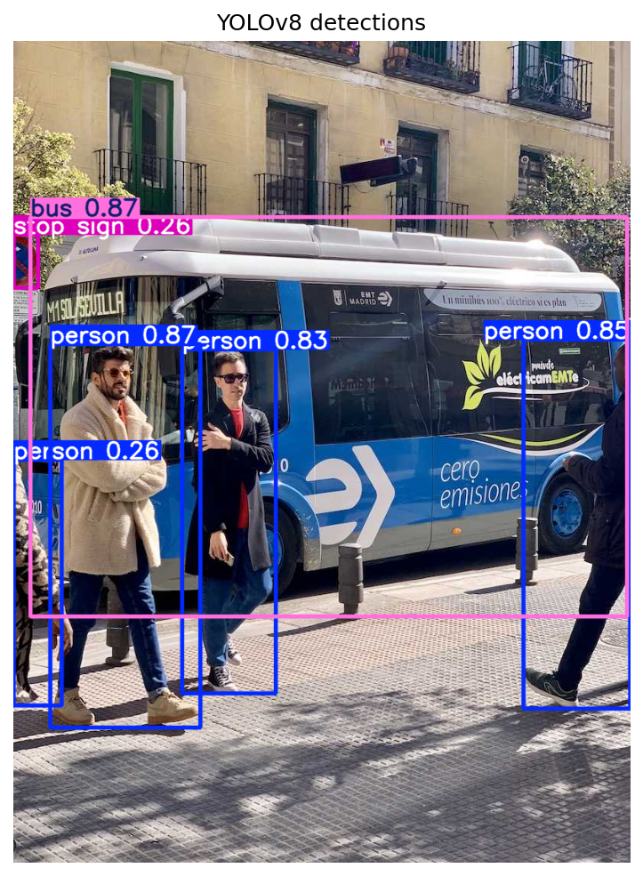
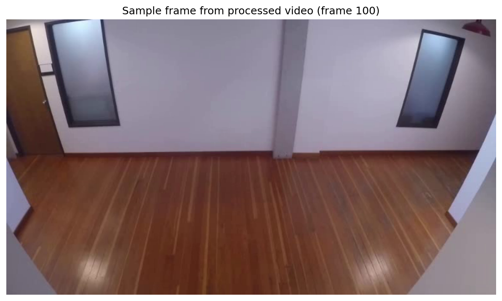
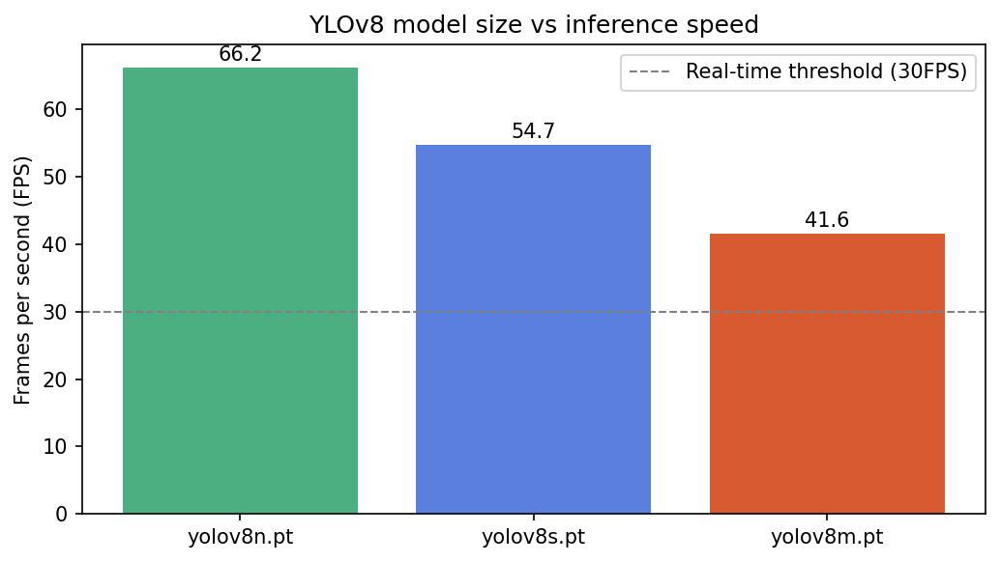

# Object Detection with YOLOv8

## Overview
A real-time object detection system built with YOLOv8 (Ultralytics) that
locates and classifies multiple objects simultaneously in images and video
frames. Unlike all previous projects in this portfolio (which answer "what
is this image?"), object detection answers "what's in this image and where?"
— outputting bounding box coordinates alongside class labels and confidence
scores. Wrapped in a FastAPI endpoint to simulate real-world deployment as
a backend service.

## Results
| Metric | Value |
|--------|-------|
| Model | YOLOv8n (nano, pretrained on COCO) |
| Classes | 80 (COCO standard categories) |
| Confidence threshold | 0.4 |
| Test image detections | 4 objects (bus + 3 people) |
| Video processed | 596 frames, 768×432 |
| Video processing speed | 89.7 FPS |





## FPS comparison across model sizes


| Model | FPS | Time/image | Size |
|-------|-----|------------|------|
| YOLOv8n (nano) | 72.0 | 13.9ms | ~6MB |
| YOLOv8s (small) | 58.3 | 17.2ms | ~22MB |
| YOLOv8m (medium) | 43.0 | 23.3ms | ~50MB |

All three variants clear the 30 FPS real-time threshold on Kaggle's T4 GPU.

## FastAPI endpoint

The detector is wrapped in a REST API endpoint that accepts an uploaded image
and returns a structured JSON response — no Python or ML knowledge required
by the consuming application.

**Request:**
```bash
curl -X POST "http://localhost:8000/detect" \
     -F "file=@your_image.jpg"
```

**Response:**
```json
{
  "detections": [
    {
      "class": "bus",
      "confidence": 0.868,
      "box": {"x_min": 22.4, "y_min": 229.0, "x_max": 805.2, "y_max": 750.4}
    },
    {
      "class": "person",
      "confidence": 0.864,
      "box": {"x_min": 48.7, "y_min": 399.4, "x_max": 243.6, "y_max": 902.8}
    }
  ],
  "count": 4
}
```

## Architecture
This project uses a fully pretrained YOLOv8 model — no custom training was
performed. YOLOv8 uses a single-pass detection architecture: rather than
first proposing candidate regions and then classifying them (two-stage
detectors like Faster R-CNN), YOLO divides the image into a grid and
simultaneously predicts bounding boxes and class probabilities for every
cell in one forward pass — which is why it achieves real-time speeds.

## Key learnings
- **Object detection is fundamentally different from classification.** Each
  prediction includes four continuous coordinates (bounding box) plus a
  class label and confidence score — not just a single category. A single
  image can yield dozens of simultaneous predictions.
- **Confidence threshold is a critical deployment decision, not a default
  to leave untouched.** At default settings, YOLOv8 produced a false
  positive "stop sign" detection at 26% confidence with no visible sign
  in frame. Applying a 0.4 threshold removed this noise entirely —
  demonstrating that real-world deployment always requires deliberate
  threshold calibration for the specific use case.
- **Speed/accuracy tradeoff is measurable and concrete.** Going from nano
  to medium reduced throughput by ~40% (72 → 43 FPS) while increasing
  model size ~8x. Both extremes clear the 30 FPS real-time bar on GPU,
  but the gap becomes practically significant on resource-constrained
  hardware (phones, embedded chips, multi-camera setups).
- **Sustained video FPS (89.7) exceeded single-image benchmark FPS (72)**
  — explained by the video's smaller frame resolution (768×432 vs the
  higher-resolution static test image), illustrating that real-world
  throughput depends on input characteristics, not just model architecture.
- **Wrapping a model in a REST API is what makes it deployable.** The
  FastAPI endpoint demonstrates how any application — mobile, web, or
  another backend — can use this detector without any knowledge of Python
  or ML, by simply sending an HTTP POST request with an image and parsing
  the JSON response.
- **Kaggle cloud notebooks can't access a local webcam** — a real
  limitation in cloud-based ML development environments. Worked around by
  processing a pre-recorded video frame-by-frame, which demonstrates
  identical real-time detection logic without requiring physical camera
  access.

## How to run
1. Clone the repo
```bash
   git clone https://github.com/SoheilKhdpnh/CNN-beginner-to-advance-project.git
```
2. Install dependencies
```bash
   pip install ultralytics fastapi uvicorn python-multipart opencv-python
   pip install matplotlib numpy pillow requests nest-asyncio
```
3. Open in Kaggle Notebooks or locally (GPU recommended for real-time speed)
4. Open the notebook
## Dataset
No custom dataset — uses YOLOv8 pretrained on
[COCO](https://cocodataset.org/) (118K training images, 80 object
categories). The model weights are downloaded automatically by the
`ultralytics` package on first run.
