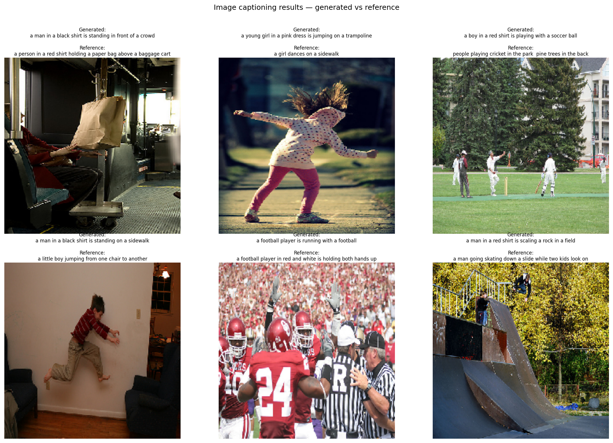

# Image Captioning

## Overview
An image captioning system that generates natural language descriptions
of photos by combining a CNN encoder (InceptionV3) with an LSTM decoder.
Given any image, the model produces a full sentence describing its content
— word by word — making this the first project in this portfolio to combine
computer vision with natural language generation. Trained on Flickr8k's
8,091 images, each annotated with 5 human-written captions.

## Results
| Metric | Score |
|--------|-------|
| BLEU-1 | 0.4963 |
| BLEU-2 | 0.3085 |
| BLEU-3 | 0.1820 |
| BLEU-4 | 0.1103 |
| Vocabulary size | 8,782 words |
| Train images | 7,281 |
| Test images | 810 |

> BLEU-4 of 0.1103 is consistent with published results for simple
> encoder-decoder LSTM captioning models on Flickr8k (typical range:
> 0.07–0.15 without attention mechanisms).


## Architecture
[Image] → InceptionV3 (pretrained, no top) → 2048-dim feature vector
↓
Dense(256) + Dropout
↓
[Partial caption] → Embedding(8782, 256) → LSTM(256)
↓
element-wise add([image, text])
↓
Dense(256, ReLU)
↓
Dense(8782, Softmax) → next word
**Two-phase design:**
1. **CNN encoder** (InceptionV3, pretrained ImageNet) — extracts a fixed
   2,048-dimensional visual summary of the image. The final classification
   layer is removed; the encoder is used purely as a feature extractor,
   never updated during training.
2. **LSTM decoder** — given the image vector as context, generates words
   one at a time using teacher forcing during training. At inference,
   generation starts from `startseq` and continues until `endseq` is
   predicted or max length is reached.

- **Optimizer:** Adam
- **Loss:** Categorical Crossentropy (next-word prediction)
- **Training:** 20 epochs, batch size 64, ~5,688 steps per epoch
- **Generation strategy:** greedy search (always pick highest-probability
  next word)

## Qualitative analysis

The model performs well on common Flickr8k scene types — dogs outdoors,
children playing, sports, people in parks — where training exposure was
high. Performance degrades on less-common scenes:

**Where it works:** scenes with strong, visually distinctive features
that appeared frequently in training (football players, dogs running,
children on swings) tend to produce plausible, partially-correct captions.

**Where it fails — hallucination:** for unusual scenes (cricket matches,
people on transit, chairs indoors), the model generates confident,
grammatically correct captions that describe the wrong content entirely
— defaulting to the nearest high-frequency training pattern rather than
the actual image. Example: "a man in a black shirt is standing in front
of a crowd" for an image of a person on a bus with a paper bag.

This hallucination tendency is a known limitation of small encoder-decoder
models trained on limited data. It's one of the core problems that
attention mechanisms and large vision-language models (CLIP, GPT-4V) are
specifically designed to address — the model attends to the whole image
equally at every step, rather than focusing on the relevant region for
each word being generated.

## Key learnings
- **CNN + RNN fusion is the foundational pattern behind modern
  vision-language models.** The specific components (InceptionV3,
  LSTM) are older, but the encode-then-decode paradigm underlies
  GPT-4V, BLIP, and other current systems.
- **BLEU scores and qualitative examples tell complementary stories.**
  Individual examples are memorable but anecdotal — some looked quite
  wrong, yet BLEU-1 of 0.496 across 810 test images shows the model
  captures correct vocabulary roughly half the time. Neither alone
  is sufficient; both belong in any honest evaluation.
- **Teacher forcing accelerates training but creates an inference gap.**
  During training, the model always receives the correct previous word
  as context. At inference, it receives its own (potentially wrong)
  previous prediction — this mismatch is a known issue called "exposure
  bias," and is one reason greedy-search captions sometimes degrade
  mid-sentence even when they start well.
- **The BLEU-1 to BLEU-4 gradient (0.496 → 0.308 → 0.182 → 0.110)
  is normal and expected.** Getting individual words right is much
  easier than matching four-word phrases exactly — a steep gradient
  is a sign of natural language generation behavior, not a model flaw.
- **`use_cudnn=False` on LSTM was necessary** — cuDNN's GPU-accelerated
  RNN implementation doesn't support left-padded sequences
  (`pad_sequences` default), requiring fallback to TensorFlow's own
  LSTM implementation. A known compatibility constraint worth
  documenting for reproducibility.

## Known limitations and natural next steps
- Greedy search is suboptimal — beam search (keeping the top K candidate
  sequences at each step) typically produces noticeably better captions
  at a modest compute cost.
- An attention mechanism would let the decoder focus on specific image
  regions per generated word, directly addressing the hallucination
  problem seen in unusual scenes.
- Training on MS-COCO (118K images vs Flickr8k's 8K) would substantially
  improve generalization to less-common scenes.

## How to run
1. Clone the repo
```bash
   git clone https://github.com/SoheilKhdpnh/CNN-beginner-to-advance-project.git
```
2. Open in Kaggle Notebooks (GPU recommended — feature extraction takes
   ~10 minutes on GPU, much longer on CPU)
3. Install dependencies
```bash
   pip install tensorflow numpy matplotlib nltk pillow
```
4. Add the Flickr8k dataset via Kaggle's Add Input panel:
   `adityajn105/flickr8k`
5. Open the notebook
advanced/03-image-captioning/notebooks/image_captioning.ipynb
## Dataset
[Flickr8k](https://www.kaggle.com/datasets/adityajn105/flickr8k)
8,091 images, each with 5 human-written captions (40,455 total).
Split: 7,281 train / 810 test (90/10 random split with seed=42).


## Architecture
