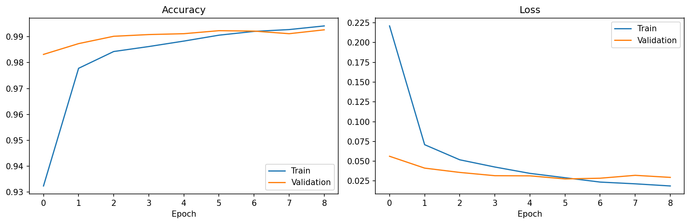
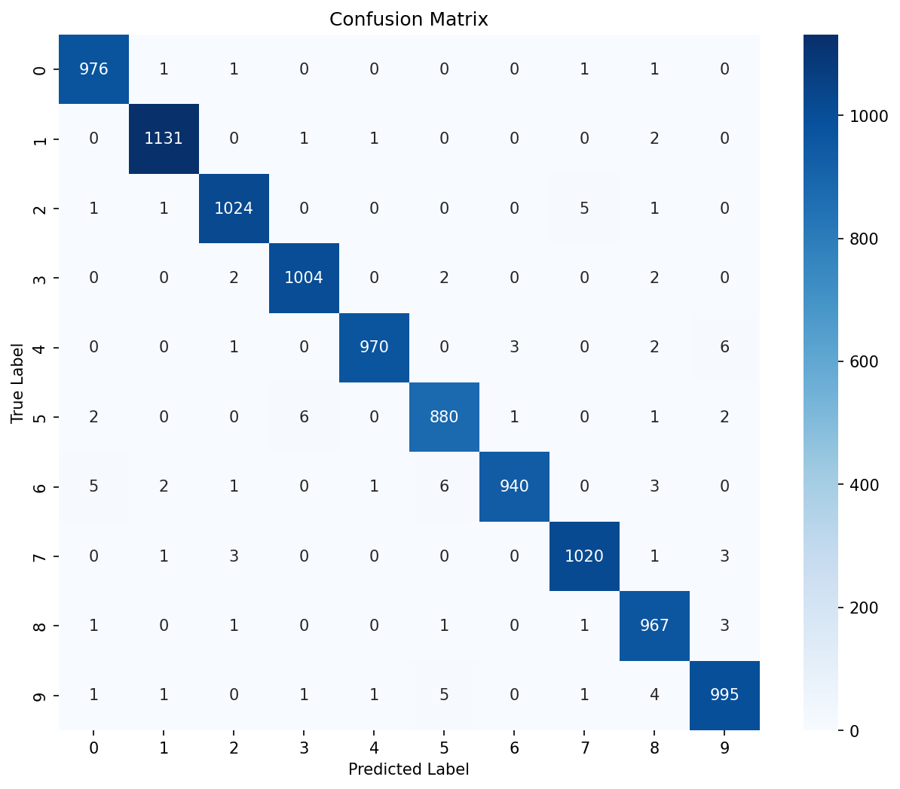

# MNIST Digit Classifier

## Overview
A Convolutional Neural Network built with TensorFlow/Keras that classifies
handwritten digits (0–9) from the MNIST dataset. Trained from scratch using
a custom 2-block CNN architecture.

## Results
| Metric | Score |
|--------|-------|
| Test accuracy | 99.1% |
| Parameters | ~93K |
| Training time | ~4 min (CPU) |




## Architecture 
- **Optimizer:** Adam  
- **Loss:** Categorical Crossentropy  
- **Epochs:** 15 (early stopping)  
- **Batch size:** 64  

## Key Learnings
- Normalizing pixels to [0,1] stabilizes training significantly
- Two Conv blocks are enough for MNIST — more layers don't help much
- Dropout(0.3) prevents overfitting even on a simple dataset
- The confusion matrix shows digit 4 and 9 are most often confused

## How to Run
1. Clone the repo
```bash
   git clone https://github.com/YOUR_USERNAME/CNN-projects-beginner-to-advance.git
```
2. Install dependencies
```bash
   pip install tensorflow numpy matplotlib seaborn scikit-learn jupyter
```
3. Open the notebook
```bash
   cd beginner/01-mnist-classifier/notebooks
   jupyter notebook mnist_classifier.ipynb
```

## Dataset
[MNIST](http://yann.lecun.com/exdb/mnist/) via `keras.datasets.mnist`  
70,000 grayscale 28×28 images — 60,000 train, 10,000 test — 10 classes (digits 0–9)