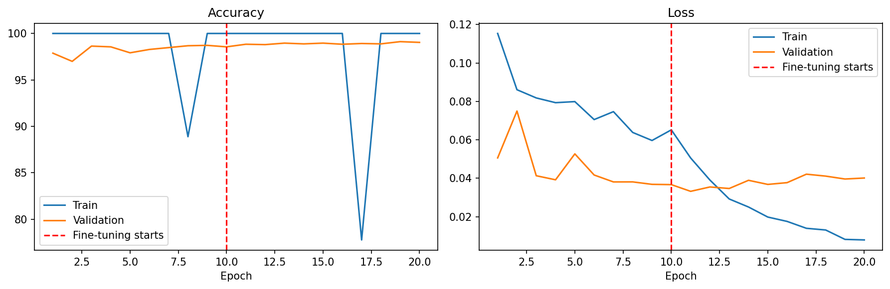

# Cats vs Dogs Classifier — PyTorch

## Overview
A re-implementation of the Cats vs Dogs binary classifier in PyTorch,
originally built with TensorFlow/Keras. Uses ResNet50 transfer learning
with a two-phase frozen/fine-tuned training strategy. Achieves 99.48%
test accuracy — a significant improvement over the original Keras
implementation (94.47%) due to the stronger ResNet50 backbone replacing
the custom 4-block CNN.

## Results
| Metric | Score |
|--------|-------|
| Test accuracy | 99.48% |
| Framework | PyTorch |
| Original Keras result | 94.47% |
| Improvement | +5.01% |
| Train images | ~19,977 |
| Val images | ~2,497 |
| Test images | ~2,498 |

## What's different from the Keras version

| Aspect | Keras version | PyTorch version |
|--------|--------------|-----------------|
| Architecture | Custom 4-block CNN | ResNet50 (pretrained ImageNet) |
| Test accuracy | 94.47% | 99.48% |
| Data loading | `ImageDataGenerator` | Custom `Dataset` + `DataLoader` |
| Transfer learning | `include_top=False` + Dense head | `model.fc` replacement |
| Freezing layers | `base_model.trainable = False` | `param.requires_grad = False` |
| Binary output | `Dense(1, sigmoid)` | `Linear(256→1)` + `BCEWithLogitsLoss` |

## Architecture
Input (3×224×224)
→ ResNet50 backbone (pretrained ImageNet, frozen in Phase 1)
→ AdaptiveAvgPool2d  [built into ResNet50]
→ Linear(2048→256) → ReLU → Dropout(0.4)
→ Linear(256→1)  [raw logit — no sigmoid]
**Two-phase training:**
1. **Phase 1 (10 epochs)** — ResNet50 frozen, only classification head
   trained. Optimizer: Adam on `model.fc.parameters()` only (lr=0.001)
2. **Phase 2 (10 epochs)** — ResNet50 `layer4` + fc unfrozen, full
   fine-tuning. Optimizer: Adam on all trainable params (lr=1e-5)

- **Loss:** BCEWithLogitsLoss (sigmoid applied internally)
- **Scheduler:** ReduceLROnPlateau (mode='max', factor=0.5, patience=3)
- **Batch size:** 32
- **Augmentation:** RandomHorizontalFlip, RandomRotation(10),
  ColorJitter(brightness, contrast, saturation, hue)
- **Normalization:** ImageNet mean [0.485, 0.456, 0.406],
  std [0.229, 0.224, 0.225]

## Key PyTorch concepts learned
- **Custom `Dataset` class** — implementing `__len__` and `__getitem__`
  to load real images from disk. The DataLoader calls `__getitem__`
  in parallel via `num_workers`, never loading the full dataset into RAM.
- **`DataLoader` parameters** — `pin_memory=True` enables faster
  CPU→GPU transfers; `num_workers=2` prefetches batches in parallel
  while the GPU processes the current one.
- **Pretrained model modification** — replacing `model.fc` (ResNet50's
  final layer) directly by attribute assignment. PyTorch's flexibility
  here is greater than Keras's `include_top=False` pattern.
- **Selective parameter freezing** — `param.requires_grad = False`
  stops gradient computation for frozen layers. The optimizer only
  receives parameters it's allowed to update via
  `filter(lambda p: p.requires_grad, model.parameters())`.
- **`BCEWithLogitsLoss` vs `CrossEntropyLoss`** — binary problems use
  a single logit output + BCEWithLogitsLoss. Multi-class problems use
  N logit outputs + CrossEntropyLoss. Both apply their activation
  internally for numerical stability.
- **`permute(1, 2, 0)`** — converts PyTorch's channels-first
  (C, H, W) tensors to matplotlib's channels-last (H, W, C) for display.
- **Corruption detection** — `imghdr.what()` checks file header bytes;
  `Image.verify()` checks full file integrity. Both are needed since
  a file can have a valid header but corrupted body. BMP files are
  valid images despite not being JPEG — format-aware filtering
  (`VALID_FORMATS` set) preserves them instead of discarding real data.

## Training curves


Notable: two sharp dips in training accuracy (epochs ~8 and ~17)
correspond to learning rate reductions by ReduceLROnPlateau. Validation
accuracy remained smooth and high throughout, confirming genuine
generalization rather than memorization.

## How to run
1. Clone the repo
```bash
   git clone https://github.com/SoheilKhdpnh/CNN-beginner-to-advance-project.git
```
2. Open in Google Colab (GPU recommended — T4 or better)
3. Install dependencies
```bash
   pip install torch torchvision matplotlib numpy pillow
```
4. Open the notebook
pytorch/02-cats-vs-dogs/notebooks/pytorch_cats_vs_dogs.ipynb

## Dataset
[Microsoft Cats and Dogs](https://www.microsoft.com/en-us/download/details.aspx?id=54765)
25,000 color images — split 80% train / 10% val / 10% test.
Corrupted files removed using `imghdr` + PIL verification.
BMP files retained as valid images (format-aware filtering).