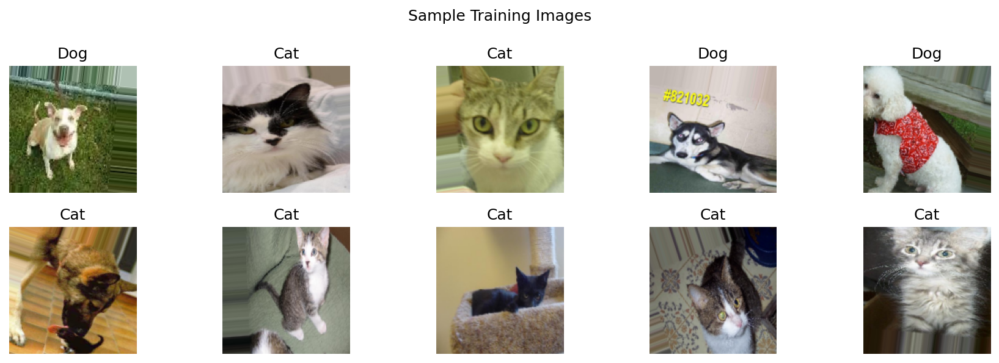
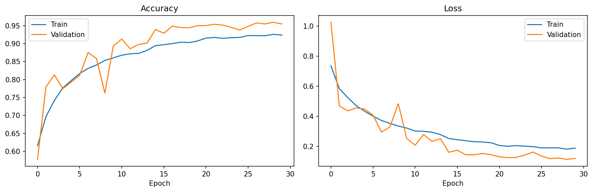
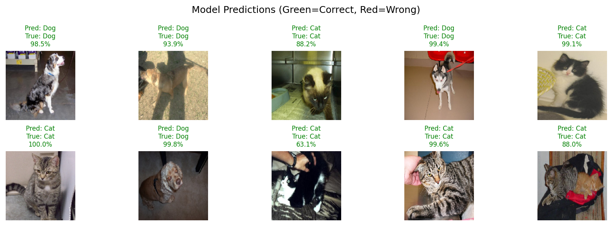

# Cats vs Dogs Classifier

## Overview
A Convolutional Neural Network built with TensorFlow/Keras that classifies
images as either a cat or a dog. Trained on real-world images from the
Microsoft Cats and Dogs dataset using a 4-block CNN architecture with
data augmentation to handle overfitting.

## Results
| Metric | Score |
|--------|-------|
| Test accuracy | 94.47% |
| Training images | 19,809 |
| Val images | 2,474 |
| Test images | 2,476 |





## Architecture
- **Optimizer:** Adam with ReduceLROnPlateau
- **Loss:** Binary Crossentropy
- **Epochs:** 30 (early stopping)
- **Batch size:** 32
- **Augmentation:** rotation, horizontal flip, zoom, shift, shear

## Key learnings
- Color images (150×150×3) are significantly harder than grayscale (28×28×1)
- Overfitting appeared early without augmentation — train accuracy climbed
  much faster than validation accuracy
- Adding 4 Conv blocks with BatchNorm and augmentation closed most of that gap
- Binary crossentropy + sigmoid output is used instead of categorical
  crossentropy + softmax since this is a 2-class problem
- ReduceLROnPlateau helped squeeze out extra accuracy once training plateaued

## How to run
1. Clone the repo
```bash
   git clone https://github.com/SoheilKhdpnh/CNN-beginner-to-advance-project.git
```
2. Open in Google Colab for GPU acceleration
3. Install dependencies
```bash
   pip install tensorflow numpy matplotlib
```
4. Open the notebook