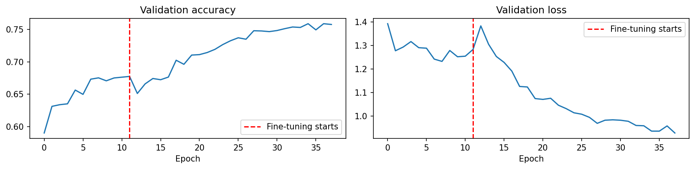
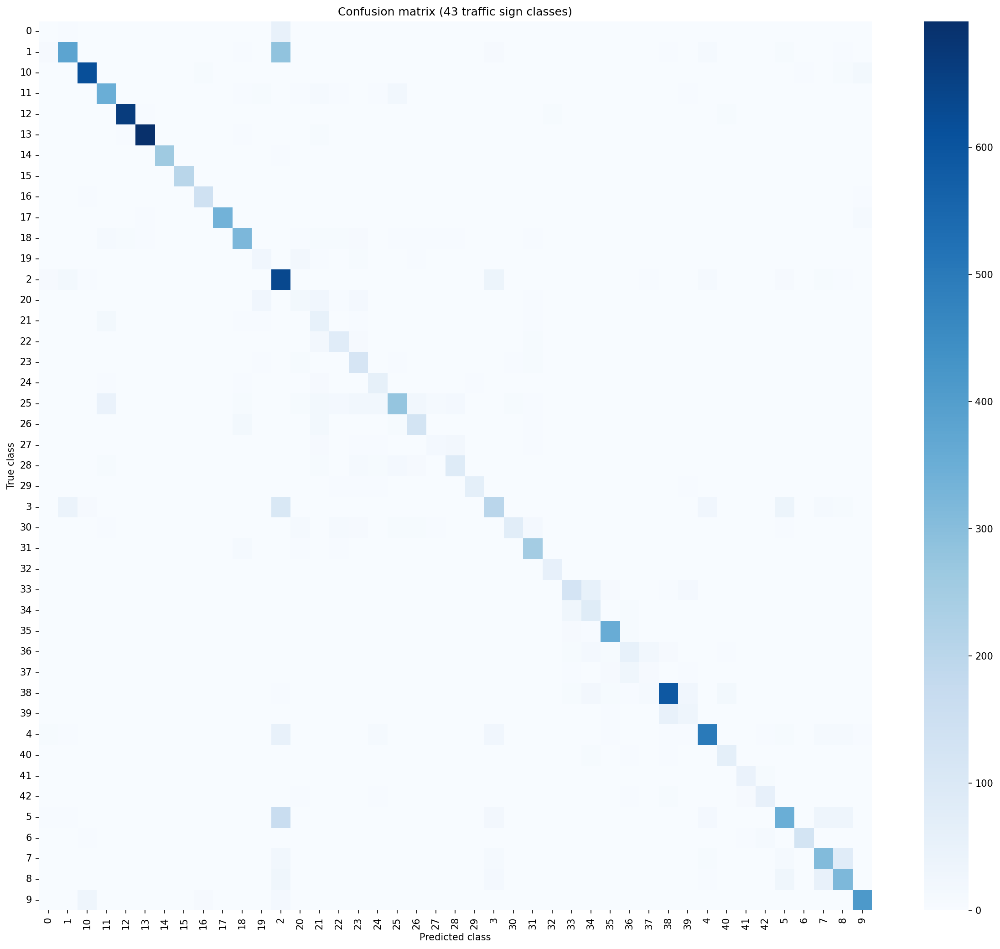
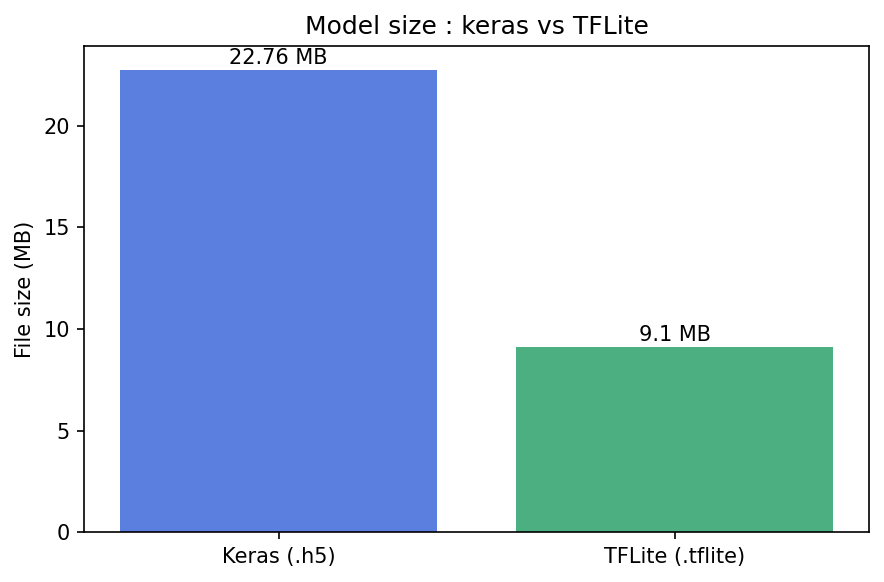

# Traffic Sign Classifier

## Overview
A CNN built with TensorFlow/Keras that classifies German traffic signs into
43 categories, using MobileNetV2 transfer learning for a lightweight model
suitable for edge deployment. Includes a TFLite conversion step to simulate
real-world deployment constraints (model size and inference speed), relevant
to applications like self-driving car perception systems.

## Results
| Metric | Score |
|--------|-------|
| Test accuracy | 76.22% |
| Classes | 43 |
| Base model | MobileNetV2 (ImageNet weights) |
| Input size | 96×96×3 |
| Train images | 33,337 |
| Val images | 5,872 |
| Test images | 12,630 |





## Edge deployment comparison (Keras vs TFLite)
| Format | File size | Inference speed (single image) |
|--------|-----------|----------------------------------|
| Keras (.h5) | 22.76 MB | 196.30 ms/image |
| TFLite (.tflite) | 9.10 MB | 1.96 ms/image |
| **Improvement** | **~60% smaller** | **~100x faster** |

> The 100x figure reflects single-image, real-time inference (simulating how
> a deployed device processes one camera frame at a time), where TFLite's
> lightweight interpreter eliminates most of Keras's per-call overhead. This
> overhead is less visible during batched training/evaluation, where many
> images are processed at once — the gap is specifically a real-time
> deployment advantage, not a raw computation speedup.

## Architecture
**Two-phase training:**
1. **Frozen base** — 66.38% val accuracy, 11 epochs (early stopped)
2. **Fine-tuning** — last 30 layers unfrozen, lr=1e-5, 77.26% val accuracy
   (+8.46 points improvement)

- **Optimizer:** Adam (lr=0.001 frozen → 1e-5 fine-tune)
- **Loss:** Categorical Crossentropy
- **Class weighting:** `compute_class_weight(balanced)` — 10.7x imbalance
  between most/least common classes (210 to 2,250 images per class)
- **No horizontal flip augmentation** — unlike Cats vs Dogs or Plant Disease,
  flipping would turn directional signs (e.g. turn-right) into the wrong
  class entirely

## Why MobileNetV2 instead of ResNet50
This project intentionally prioritizes a lightweight backbone over the
higher-capacity ResNet50 used in the Plant Disease Detector, since the
real-world use case (in-vehicle sign recognition) requires fast, low-latency
inference. MobileNetV2's frozen body is ~2.3M parameters vs ResNet50's ~24M —
roughly a 10x reduction — at an acceptable accuracy tradeoff for a 43-class,
visually simple geometric-shape classification task.

## Key learnings
- **Class 0 (Speed limit 20km/h) was the hardest class by far** (f1: 0.03).
  It combines the fewest training images (210, tied for rarest) with the
  highest visual similarity to neighboring speed-limit signs — all share an
  identical red circular template, differing only in printed digits. At
  96×96 resolution, this fine digit detail is the first thing lost to
  downscaling and pooling.
- **Speed-limit-style signs (same shape, different number) were
  systematically harder than distinctly-shaped signs** (e.g. stop, yield,
  priority), confirming that shape alone isn't sufficient — the model must
  resolve fine print detail for an entire sign sub-category.
- **Train accuracy (96%) vs validation (77%) showed a real gap during
  fine-tuning**, but test accuracy (76.22%) closely matched validation,
  confirming the model generalizes reasonably — the gap reflects some
  training-set memorization rather than a broken evaluation.
- **TFLite conversion is "free" accuracy-wise** — a 60% size reduction and
  ~100x faster single-image inference came with zero retraining and no
  accuracy loss, since this was a format conversion, not quantization.
- **Macro avg f1 (0.68) trailing weighted avg f1 (0.76)** shows rare classes
  drag down "treat every class equally" performance even after weighting —
  class weighting helps but doesn't fully equalize outcomes across a 10.7x
  imbalance.

## How to run
1. Clone the repo
```bash
   git clone https://github.com/SoheilKhdpnh/CNN-beginner-to-advance-project.git
```
2. Open in Kaggle Notebooks (GPU recommended)
3. Install dependencies
```bash
   pip install tensorflow numpy matplotlib seaborn scikit-learn pandas
```
4. Open the notebook
## Dataset
[GTSRB - German Traffic Sign Recognition Benchmark](https://www.kaggle.com/datasets/meowmeowmeowmeowmeow/gtsrb-german-traffic-sign)
~50,000 images across 43 traffic sign classes, with a CSV-based test set
(`Test.csv`) mapping filenames to labels rather than folder-sorted images.
